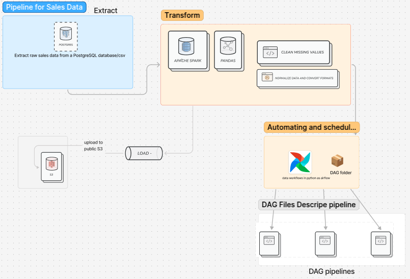

# ETL Pipeline for Sales Data

## Overview
This project implements an **ETL (Extract, Transform, Load) pipeline** using **PostgreSQL, Apache Spark, AWS S3, and Apache Airflow**. The pipeline extracts sales data, processes it, and stores the transformed data in AWS S3, with **automation using Apache Airflow**.

---


---

## Project Architecture

1. **Extract**: Retrieve raw sales data from a PostgreSQL database or CSV.
2. **Transform**: Clean, normalize, and preprocess data using Apache Spark and Pandas.
3. **Load**: Store processed data into AWS S3.
4. **Automate**: Schedule and manage tasks using Apache Airflow.

---

## Folder Structure
```
ETL_Pipeline_Project/
│── dags/                 # Airflow DAGs for pipeline automation
│── data/                 # Raw data files (if applicable)
│── scripts/              # Python scripts for ETL processes
│── logs/                 # Log files for monitoring
│── config/               # Configuration files (e.g., DB credentials)
│── README.md             # Project documentation
```

---

## Installation & Setup
### Prerequisites:
- Python 3.8+
- PostgreSQL
- Apache Spark
- AWS S3 Account
- Apache Airflow

### Install Required Packages:
```bash
pip install pandas psycopg2 sqlalchemy pyspark boto3 apache-airflow
```

---

## Steps in the ETL Pipeline

### **Step 1: Extract Data**
**Libraries Used:**
- `pandas`: Load, process, and save tabular data.
- `psycopg2`: Connect to PostgreSQL.
- `sqlalchemy`: Manage database connections.

**Why?**
- Fetch sales data from PostgreSQL using `psycopg2`.
- Load data into a **pandas DataFrame** for further processing.

### **Step 2: Transform Data**
**Libraries Used:**
- `pyspark`: Big data processing.
- `pandas`: Additional data manipulation.

**Why?**
- **Clean missing values** and normalize columns.
- Convert data formats and ensure consistency before loading.

### **Step 3: Load Data to AWS S3**
**Libraries Used:**
- `boto3`: AWS SDK for uploading data.

**Why?**
- Store processed data into **AWS S3** for further analysis.

### **Step 4: Automate with Apache Airflow**
**Libraries Used:**
- `apache-airflow`: Workflow orchestration.

**Why?**
- Schedule and automate the **ETL process** efficiently.
- Define DAGs (**Directed Acyclic Graphs**) for task dependencies.

---

## Summary of Libraries Used

| Library        | Purpose                                       |
|---------------|-----------------------------------------------|
| `pandas`      | Data manipulation & cleaning                 |
| `psycopg2`    | Connect to PostgreSQL                        |
| `sqlalchemy`  | Manage database connections                  |
| `pyspark`     | Handle big data transformations              |
| `boto3`       | Upload data to AWS S3                        |
| `apache-airflow` | Automate pipeline execution              |

---

## Running the Pipeline

1. **Extract Data**: Run the `extract.py` script in the `scripts/` folder.
```bash
python scripts/extract.py
```
2. **Transform Data**: Run the `transform.py` script.
```bash
python scripts/transform.py
```
3. **Load Data to S3**: Run the `load.py` script.
```bash
python scripts/load.py
```
4. **Schedule the pipeline** using Apache Airflow.
```bash
airflow scheduler
```

---

## Conclusion
This ETL pipeline allows **automated processing** of sales data, ensuring **scalability and efficiency**. 

Happy coding! 🚀

